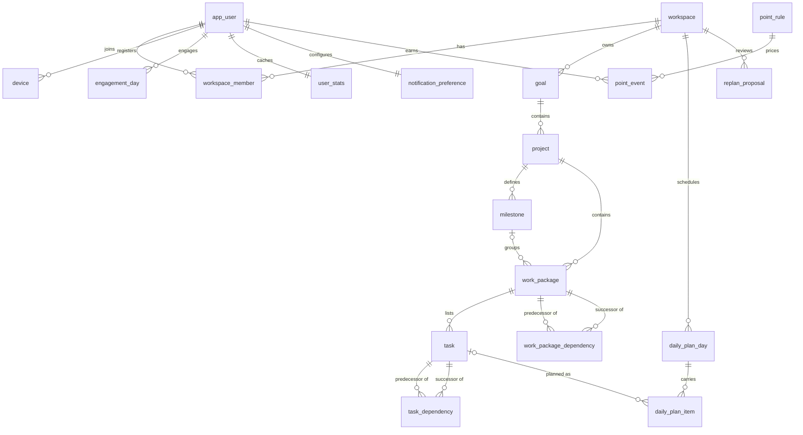

# Relational Data Model
## Goal-Driven Planning Platform — Phase 1 (Postgres / Supabase)

**Status:** v1 for review · **Date:** June 11, 2026
**Derived from:** `product-foundation.md` (§3 Domain Model, §4 Core Features, §7 Future Features, §9 Architecture)
**Target:** standard PostgreSQL (Supabase-hosted in Phase 1, portable to AWS as-is per §9.2 rule 4)

---

## 1. Modeling Conventions

These conventions apply to every table unless stated otherwise.

| Convention | Rule | Rationale |
|---|---|---|
| **Primary keys** | `id uuid PRIMARY KEY DEFAULT gen_random_uuid()` | Globally unique, safe for client-side generation and future sync/offline scenarios (§7). |
| **Timestamps** | `created_at timestamptz NOT NULL DEFAULT now()`, `updated_at timestamptz NOT NULL DEFAULT now()` (maintained by the API layer) | Audit basics; no DB triggers per §9.2 rule 6. |
| **Tenancy** | Every domain table carries `workspace_id uuid NOT NULL REFERENCES workspace(id)` even when the parent chain implies it | Multi-tenant-ready per §7: enables row-level security and team workspaces later without schema surgery. In v1, one workspace == one user. |
| **Deletes** | `ON DELETE CASCADE` down the WBS hierarchy; `ON DELETE SET NULL` for optional groupings (milestone) | The WBS is a strict composition; milestones are optional groupings (§3.2). |
| **Naming** | `snake_case`, singular table names | Consistency. |
| **Enums** | Postgres `ENUM` types (§2 below) | Self-documenting, portable, cheap to extend with `ALTER TYPE … ADD VALUE`. |
| **No triggers** | All derived/cached state is maintained by the API's business-logic modules | Binding rule §9.2 #6; logic stays portable to AWS. |
| **Auth coupling** | The app's `app_user` row references the external auth subject by an opaque string, never by FK into `auth.users` | §9.2 rule 5: auth must be swappable without touching business tables. |

---

## 2. Enumerated Types

```sql
CREATE TYPE goal_horizon       AS ENUM ('short', 'mid', 'long');
CREATE TYPE goal_status        AS ENUM ('active', 'achieved', 'archived');
CREATE TYPE project_status     AS ENUM ('active', 'completed', 'archived');
CREATE TYPE difficulty_level   AS ENUM ('low', 'mid', 'high');
CREATE TYPE task_status        AS ENUM ('todo', 'done');
CREATE TYPE day_status         AS ENUM ('proposed', 'confirmed', 'completed', 'slipped');
CREATE TYPE plan_item_type     AS ENUM ('task');                -- future: 'inbox_triage' (§7)
CREATE TYPE plan_item_status   AS ENUM ('planned', 'completed', 'deferred');
CREATE TYPE plan_item_origin   AS ENUM ('proposed', 'user_added', 'pulled_forward', 'replanned');
CREATE TYPE proposal_trigger   AS ENUM ('slippage', 'new_work_package', 'user_request');
CREATE TYPE proposal_status    AS ENUM ('pending', 'approved', 'edited_approved', 'rejected', 'expired');
CREATE TYPE point_event_type   AS ENUM ('task_completed', 'daily_goal_completed', 'milestone_achieved');
CREATE TYPE workspace_role     AS ENUM ('owner');               -- future: 'admin', 'member' (§7)
CREATE TYPE device_platform    AS ENUM ('ios');                 -- future: 'android', 'web_push' (§7)
```

Note that `blocked` is deliberately **not** a stored task/work-package status — blocked is *derived* from the dependency graph (see §6, Derived State). Storing it would create a second source of truth that drifts from the dependency tables.

---

## 3. Entity-Relationship Overview

```
workspace ──< workspace_member >── app_user ──< device
    │                                  │
    │                                  ├──< engagement_day        (streak source of truth)
    │                                  ├──── user_stats           (cached totals)
    │                                  └──── notification_preference
    │
    └──< goal ──< project ──┬──< milestone
                            │        ▲ 0..1 (optional grouping)
                            └──< work_package ──< task
                                     │  ▲             │  ▲
                                     └──┘             └──┘
                              work_package_dependency  task_dependency
                                   (N:M self)            (N:M self)

daily_plan_day ──< daily_plan_item >── task          (roadmap day-steps & Daily Goals)
replan_proposal                                       (human-in-the-loop change pipeline)
point_rule ──< point_event >── task | daily_plan_day | milestone   (scoring ledger)
```



---

## 4. Tables

### 4.1 Identity & Tenancy

#### `workspace`

The ownership root for all domain data. In v1 every workspace belongs to exactly one user (§7 "avoid assumptions that user == workspace in code"); later it becomes the shared-team container.

| Column | Type | Null | Default | Constraints / Notes |
|---|---|---|---|---|
| `id` | `uuid` | NO | `gen_random_uuid()` | **PK** |
| `name` | `text` | NO | — | Display name; in v1 defaults to the owner's name. |
| `created_at` | `timestamptz` | NO | `now()` | |
| `updated_at` | `timestamptz` | NO | `now()` | |

#### `app_user`

The application's own user record. Authentication identity (Supabase Auth in Phase 1) is referenced only via an opaque external id, keeping auth swappable (§9.2 rule 5).

| Column | Type | Null | Default | Constraints / Notes |
|---|---|---|---|---|
| `id` | `uuid` | NO | `gen_random_uuid()` | **PK** |
| `auth_subject` | `text` | NO | — | **UNIQUE.** External auth provider's subject id (today: `auth.users.id` as text). No FK — loose coupling. |
| `email` | `text` | NO | — | **UNIQUE** (index on `lower(email)`). |
| `display_name` | `text` | YES | — | |
| `timezone` | `text` | NO | `'UTC'` | IANA name (e.g. `Europe/Istanbul`). Drives the **midnight-local** day boundary for streak and slippage detection (§3.2, Decision #14). |
| `created_at` | `timestamptz` | NO | `now()` | |
| `updated_at` | `timestamptz` | NO | `now()` | |

#### `workspace_member`

Join table between users and workspaces. v1 invariant (application-enforced): exactly one row per workspace, with role `owner`. Exists now so team collaboration (§7) is a data addition, not a migration.

| Column | Type | Null | Default | Constraints / Notes |
|---|---|---|---|---|
| `workspace_id` | `uuid` | NO | — | **PK part**, FK → `workspace(id)` ON DELETE CASCADE |
| `user_id` | `uuid` | NO | — | **PK part**, FK → `app_user(id)` ON DELETE CASCADE |
| `role` | `workspace_role` | NO | `'owner'` | |
| `created_at` | `timestamptz` | NO | `now()` | |

**Keys:** PK `(workspace_id, user_id)`. Index on `user_id` (login → workspace lookup).

#### `device`

Push-notification endpoints for the Companion (§4.6). One user may have several devices.

| Column | Type | Null | Default | Constraints / Notes |
|---|---|---|---|---|
| `id` | `uuid` | NO | `gen_random_uuid()` | **PK** |
| `user_id` | `uuid` | NO | — | FK → `app_user(id)` ON DELETE CASCADE |
| `platform` | `device_platform` | NO | `'ios'` | |
| `push_token` | `text` | NO | — | **UNIQUE.** APNs token in v1. |
| `last_seen_at` | `timestamptz` | YES | — | For pruning stale tokens. |
| `created_at` | `timestamptz` | NO | `now()` | |

---

### 4.2 The WBS Hierarchy

#### `goal`

Top of the hierarchy, owned directly by the workspace (§3.1): "an outcome the user is pursuing", tagged short/mid/long term.

| Column | Type | Null | Default | Constraints / Notes |
|---|---|---|---|---|
| `id` | `uuid` | NO | `gen_random_uuid()` | **PK** |
| `workspace_id` | `uuid` | NO | — | FK → `workspace(id)` ON DELETE CASCADE |
| `title` | `text` | NO | — | `CHECK (length(trim(title)) > 0)` |
| `description` | `text` | YES | — | |
| `horizon` | `goal_horizon` | NO | — | short / mid / long term tag (Decision #4). |
| `status` | `goal_status` | NO | `'active'` | |
| `achieved_at` | `timestamptz` | YES | — | Set by the API when status → `achieved`. |
| `position` | `integer` | NO | `0` | Manual sort order in lists. |
| `created_at` / `updated_at` | `timestamptz` | NO | `now()` | |

**Indexes:** `(workspace_id, status)`.

#### `project`

A concrete initiative under a goal with a definable end. Carries the **capacity** setting — hours per day the user wants to spend (§3.2 Capacity, Decision #12).

| Column | Type | Null | Default | Constraints / Notes |
|---|---|---|---|---|
| `id` | `uuid` | NO | `gen_random_uuid()` | **PK**; also **UNIQUE `(id, workspace_id)`** to support composite FKs below. |
| `workspace_id` | `uuid` | NO | — | FK → `workspace(id)` ON DELETE CASCADE |
| `goal_id` | `uuid` | NO | — | FK → `goal(id)` ON DELETE CASCADE |
| `title` | `text` | NO | — | `CHECK (length(trim(title)) > 0)` |
| `description` | `text` | YES | — | |
| `capacity_hours_per_day` | `numeric(4,2)` | NO | — | `CHECK (capacity_hours_per_day > 0 AND capacity_hours_per_day <= 24)`. The planner fills each day up to this value. |
| `status` | `project_status` | NO | `'active'` | |
| `target_end_date` | `date` | YES | — | Optional deadline for the project as a whole. |
| `completed_at` | `timestamptz` | YES | — | |
| `position` | `integer` | NO | `0` | |
| `created_at` / `updated_at` | `timestamptz` | NO | `now()` | |

**Indexes:** `(goal_id)`, `(workspace_id, status)`.

#### `milestone`

A named checkpoint within a project, defined as a **set of work packages** (Decision #5). The set membership lives on `work_package.milestone_id` — a work package belongs to at most one milestone, or none.

| Column | Type | Null | Default | Constraints / Notes |
|---|---|---|---|---|
| `id` | `uuid` | NO | `gen_random_uuid()` | **PK**; also **UNIQUE `(id, project_id)`** — referenced by `work_package`'s composite FK to guarantee same-project grouping. |
| `workspace_id` | `uuid` | NO | — | FK → `workspace(id)` ON DELETE CASCADE |
| `project_id` | `uuid` | NO | — | FK → `project(id)` ON DELETE CASCADE |
| `title` | `text` | NO | — | `CHECK (length(trim(title)) > 0)` |
| `description` | `text` | YES | — | Feeds the celebration recap card (§4.5). |
| `achieved_at` | `timestamptz` | YES | — | Set **once** by the API when every work package in the set is complete; gates the celebration + extra points so they fire exactly once. |
| `position` | `integer` | NO | `0` | Display order along the roadmap. |
| `created_at` / `updated_at` | `timestamptz` | NO | `now()` | |

**Indexes:** `(project_id)`.

#### `work_package`

A **to-do list object** (§3.1): a cohesive chunk of project work, the planning unit for dependencies and estimation. May join a milestone's set; may be time-fixed.

| Column | Type | Null | Default | Constraints / Notes |
|---|---|---|---|---|
| `id` | `uuid` | NO | `gen_random_uuid()` | **PK** |
| `workspace_id` | `uuid` | NO | — | FK → `workspace(id)` ON DELETE CASCADE |
| `project_id` | `uuid` | NO | — | FK → `project(id)` ON DELETE CASCADE |
| `milestone_id` | `uuid` | YES | — | Optional grouping. Composite FK `(milestone_id, project_id)` → `milestone(id, project_id)` **ON DELETE SET NULL** — guarantees the milestone belongs to the *same project*; deleting a milestone ungroups its work packages instead of deleting work. |
| `title` | `text` | NO | — | `CHECK (length(trim(title)) > 0)` |
| `description` | `text` | YES | — | |
| `estimate_hours` | `numeric(5,2)` | YES | — | `CHECK (estimate_hours > 0)` |
| `difficulty` | `difficulty_level` | YES | — | **Either/or estimation (Decision #13):** `CHECK (num_nonnulls(estimate_hours, difficulty) <= 1)`. Both NULL = not yet estimated. Difficulty→hours mapping is a planner constant (open question §10 of the foundation doc). |
| `is_time_fixed` | `boolean` | NO | `false` | Time-fixed work is never auto-moved by replanning (Decision #7). |
| `fixed_date` | `date` | YES | — | `CHECK (is_time_fixed = (fixed_date IS NOT NULL))` |
| `completed_at` | `timestamptz` | YES | — | Cache set by the API when all child tasks are done; cleared if a task reopens. Source of truth remains the tasks (§6). |
| `position` | `integer` | NO | `0` | Order within the project / milestone. |
| `created_at` / `updated_at` | `timestamptz` | NO | `now()` | |

**Indexes:** `(project_id)`, `(milestone_id)`, partial `(project_id) WHERE completed_at IS NULL` (open-work scans for the planner).

#### `task`

A single to-do line inside a work package — the atomic unit of doing (§3.1). What appears in Daily Goals and gets checked off.

| Column | Type | Null | Default | Constraints / Notes |
|---|---|---|---|---|
| `id` | `uuid` | NO | `gen_random_uuid()` | **PK** |
| `workspace_id` | `uuid` | NO | — | FK → `workspace(id)` ON DELETE CASCADE |
| `work_package_id` | `uuid` | NO | — | FK → `work_package(id)` ON DELETE CASCADE |
| `title` | `text` | NO | — | `CHECK (length(trim(title)) > 0)` |
| `notes` | `text` | YES | — | |
| `estimate_hours` | `numeric(4,2)` | YES | — | `CHECK (estimate_hours > 0)` |
| `difficulty` | `difficulty_level` | YES | — | `CHECK (num_nonnulls(estimate_hours, difficulty) <= 1)` — same either/or rule as work packages. |
| `is_time_fixed` | `boolean` | NO | `false` | |
| `fixed_date` | `date` | YES | — | `CHECK (is_time_fixed = (fixed_date IS NOT NULL))` |
| `status` | `task_status` | NO | `'todo'` | `CHECK ((status = 'done') = (completed_at IS NOT NULL))`. `blocked` is derived, never stored (§6). |
| `completed_at` | `timestamptz` | YES | — | |
| `position` | `integer` | NO | `0` | Order within the to-do list. |
| `created_at` / `updated_at` | `timestamptz` | NO | `now()` | |

**Indexes:** `(work_package_id)`, partial `(workspace_id) WHERE status = 'todo'` (planner candidate scans).

---

### 4.3 Dependencies

Dependencies exist at **two levels** (Decision #9) — between tasks and between work packages — as a directed "must finish before" relationship. Two structurally identical self-referencing join tables keep the model explicit and the FK semantics clean (no polymorphism).

#### `task_dependency`

| Column | Type | Null | Default | Constraints / Notes |
|---|---|---|---|---|
| `predecessor_task_id` | `uuid` | NO | — | **PK part**, FK → `task(id)` ON DELETE CASCADE. Must finish first. |
| `successor_task_id` | `uuid` | NO | — | **PK part**, FK → `task(id)` ON DELETE CASCADE. Blocked until predecessor is done. |
| `workspace_id` | `uuid` | NO | — | FK → `workspace(id)` ON DELETE CASCADE |
| `created_at` | `timestamptz` | NO | `now()` | |

**Keys & constraints:** PK `(predecessor_task_id, successor_task_id)` — also prevents duplicate edges. `CHECK (predecessor_task_id <> successor_task_id)` — no self-dependency. Index on `successor_task_id` (reverse traversal: "what blocks me?").
**Acyclicity** is enforced in the API's dependency module on every edge insert/update (graph reachability check), not by a DB trigger (§9.2 rule 6).

#### `work_package_dependency`

| Column | Type | Null | Default | Constraints / Notes |
|---|---|---|---|---|
| `predecessor_wp_id` | `uuid` | NO | — | **PK part**, FK → `work_package(id)` ON DELETE CASCADE |
| `successor_wp_id` | `uuid` | NO | — | **PK part**, FK → `work_package(id)` ON DELETE CASCADE |
| `workspace_id` | `uuid` | NO | — | FK → `workspace(id)` ON DELETE CASCADE |
| `created_at` | `timestamptz` | NO | `now()` | |

**Keys & constraints:** PK `(predecessor_wp_id, successor_wp_id)`; `CHECK (predecessor_wp_id <> successor_wp_id)`; index on `successor_wp_id`. Acyclicity enforced in the application layer. A task inside a work package whose upstream work-package dependency is incomplete is *blocked* — the planner resolves both levels when computing schedulable work.

---

### 4.4 Planning, Roadmap & Daily Goals

The roadmap is a **projection**, not a stored artifact (§3.2): only the materialized day-steps — proposed and confirmed Daily Goals — are persisted. Past days are the filled-in path; future confirmed days are the path ahead; everything beyond is recomputed by the planner on demand.

#### `daily_plan_day`

One roadmap day-step for a workspace: the container for that day's Daily Goals.

| Column | Type | Null | Default | Constraints / Notes |
|---|---|---|---|---|
| `id` | `uuid` | NO | `gen_random_uuid()` | **PK** |
| `workspace_id` | `uuid` | NO | — | FK → `workspace(id)` ON DELETE CASCADE |
| `plan_date` | `date` | NO | — | **UNIQUE `(workspace_id, plan_date)`** — one day-step per calendar day. Interpreted in the user's timezone; the midnight-local boundary (Decision #14) is computed by the API using `app_user.timezone`. |
| `status` | `day_status` | NO | `'proposed'` | `proposed` → `confirmed` (user approved, Principle 1) → `completed` (all items done — awards daily-goal points) or `slipped` (day boundary passed with incomplete items → feeds the replanning pipeline §4.4 of the foundation doc). |
| `is_locked` | `boolean` | NO | `false` | User locked the day; the planner must not propose changes to it. |
| `confirmed_at` | `timestamptz` | YES | — | `CHECK ((status IN ('confirmed','completed','slipped')) = (confirmed_at IS NOT NULL))` is intentionally *not* hard-coded — a slipped day may never have been confirmed. API maintains consistency. |
| `completed_at` | `timestamptz` | YES | — | Set when the last item completes; gates the daily-goal point award (once). |
| `created_at` / `updated_at` | `timestamptz` | NO | `now()` | |

**Indexes:** UNIQUE `(workspace_id, plan_date)`; `(workspace_id, status)`.

#### `daily_plan_item`

A line on a day's plan. v1 items are always tasks; the `item_type` column is the **extension seam for the Content Inbox** (§7): a future `inbox_triage` item type joins the same morning flow without reshaping the planning tables.

| Column | Type | Null | Default | Constraints / Notes |
|---|---|---|---|---|
| `id` | `uuid` | NO | `gen_random_uuid()` | **PK** |
| `workspace_id` | `uuid` | NO | — | FK → `workspace(id)` ON DELETE CASCADE |
| `daily_plan_day_id` | `uuid` | NO | — | FK → `daily_plan_day(id)` ON DELETE CASCADE |
| `item_type` | `plan_item_type` | NO | `'task'` | Future values get their own nullable FK column (e.g. `inbox_item_id`), each guarded by a type-matching CHECK. |
| `task_id` | `uuid` | YES | — | FK → `task(id)` ON DELETE CASCADE. `CHECK ((item_type = 'task') = (task_id IS NOT NULL))`. |
| `status` | `plan_item_status` | NO | `'planned'` | `completed` mirrors the task completion on this day; `deferred` records that a replan moved the work to a later day (the new day gets a fresh item — history is preserved, replanning is never penalized, Principle 3). |
| `origin` | `plan_item_origin` | NO | `'proposed'` | How the item got onto this day: planner proposal, user addition, **pulled forward** (working ahead, Decision #12), or an approved replan. |
| `position` | `integer` | NO | `0` | Order within the day. |
| `created_at` / `updated_at` | `timestamptz` | NO | `now()` | |

**Keys & constraints:**
- UNIQUE `(daily_plan_day_id, task_id)` — a task appears at most once per day.
- Partial UNIQUE index `ON daily_plan_item (task_id) WHERE status = 'planned'` — a task can be *actively planned* on only one day at a time; pulling a task forward moves the planned item (old item deleted or marked `deferred`, new item created with `origin = 'pulled_forward'`).
- Index `(daily_plan_day_id)`.

---

### 4.5 Replanning Pipeline (Human in the Loop)

#### `replan_proposal`

Persists the detect → analyze → **propose** → **approve** pipeline (§4.4 of the foundation doc). The roadmap is updated **only** when a proposal is approved (Principle 1) — this table is the audit trail proving no plan was ever silently rewritten.

| Column | Type | Null | Default | Constraints / Notes |
|---|---|---|---|---|
| `id` | `uuid` | NO | `gen_random_uuid()` | **PK** |
| `workspace_id` | `uuid` | NO | — | FK → `workspace(id)` ON DELETE CASCADE |
| `trigger` | `proposal_trigger` | NO | — | `slippage` (midnight detection), `new_work_package` (mid-flight addition), `user_request` (manual replan). |
| `status` | `proposal_status` | NO | `'pending'` | `approved` / `edited_approved` / `rejected` / `expired` (superseded by a newer proposal). |
| `summary` | `text` | NO | — | The human-readable headline shown in the morning brief, e.g. *"Push 3 tasks forward one day; milestone moves Fri → Mon."* |
| `changes` | `jsonb` | NO | — | Structured diff the engine produced: per-item moves (`task_id`, `from_date`, `to_date`), affected milestones with old/new projected dates, and **time-fixed conflicts** listed separately with their options (prioritize / descope / renegotiate) — time-fixed work is never auto-moved (Decision #7). |
| `applied_changes` | `jsonb` | YES | — | What was actually applied if the user edited before approving (`edited_approved`). |
| `resolved_by_user_id` | `uuid` | YES | — | FK → `app_user(id)` ON DELETE SET NULL |
| `resolved_at` | `timestamptz` | YES | — | `CHECK ((status <> 'pending') = (resolved_at IS NOT NULL))` |
| `created_at` | `timestamptz` | NO | `now()` | |

**Indexes:** partial `(workspace_id) WHERE status = 'pending'` (the morning brief asks "anything awaiting approval?").

> **Design note — JSONB vs. child rows.** The proposal payload is a *transient draft*: relational truth only changes when the approved diff is applied to `daily_plan_item` / `daily_plan_day` by the API. Keeping the draft as JSONB keeps the schema clean while the planning engine remains "modular and replaceable" (Decision #19); JSONB is standard Postgres and fully portable (§9.2 rule 4). If proposals later need querying *inside* the diff, promote to a `replan_proposal_change` child table.

---

### 4.6 Motivation Layer — Points, Streak, Stats

#### `point_rule`

The fixed point values per scoring event (Decision #11). Seeded constants, stored as data so tuning (open question, foundation §10) is a row update, not a deploy.

| Column | Type | Null | Default | Constraints / Notes |
|---|---|---|---|---|
| `event_type` | `point_event_type` | NO | — | **PK** |
| `points` | `integer` | NO | — | `CHECK (points > 0)` |

Seed rows: `task_completed`, `daily_goal_completed`, `milestone_achieved` (extra points).

#### `point_event`

Append-only scoring ledger — the source of truth for points. Tasks completed after a replan score normally; there is deliberately **no penalty event type** (Principle 3).

| Column | Type | Null | Default | Constraints / Notes |
|---|---|---|---|---|
| `id` | `uuid` | NO | `gen_random_uuid()` | **PK** |
| `workspace_id` | `uuid` | NO | — | FK → `workspace(id)` ON DELETE CASCADE |
| `user_id` | `uuid` | NO | — | FK → `app_user(id)` ON DELETE CASCADE — who earned it (matters once workspaces are shared, §7). |
| `event_type` | `point_event_type` | NO | — | FK → `point_rule(event_type)` |
| `points` | `integer` | NO | — | Copied from `point_rule` at award time so history survives later tuning. |
| `task_id` | `uuid` | YES | — | FK → `task(id)` ON DELETE SET NULL |
| `daily_plan_day_id` | `uuid` | YES | — | FK → `daily_plan_day(id)` ON DELETE SET NULL |
| `milestone_id` | `uuid` | YES | — | FK → `milestone(id)` ON DELETE SET NULL |
| `occurred_at` | `timestamptz` | NO | `now()` | |

**Keys & constraints:**
- `CHECK (num_nonnulls(task_id, daily_plan_day_id, milestone_id) = 1)` — every event points at exactly one source.
- Type/source agreement: `CHECK ((event_type = 'task_completed') = (task_id IS NOT NULL) AND (event_type = 'daily_goal_completed') = (daily_plan_day_id IS NOT NULL) AND (event_type = 'milestone_achieved') = (milestone_id IS NOT NULL))`.
- **Double-award prevention** via partial unique indexes: `UNIQUE (task_id) WHERE task_id IS NOT NULL`, `UNIQUE (daily_plan_day_id) WHERE daily_plan_day_id IS NOT NULL`, `UNIQUE (milestone_id) WHERE milestone_id IS NOT NULL` — each task, daily goal, and milestone scores exactly once, ever (un-completing and re-completing a task does not farm points).
- Index `(workspace_id, occurred_at)` for history views.

#### `engagement_day`

Source of truth for the **streak** (Decision #8): one row per local calendar day on which the user opened and engaged with their plan (viewed/adjusted Daily Goals, completed or rescheduled work). Completion is *not* required.

| Column | Type | Null | Default | Constraints / Notes |
|---|---|---|---|---|
| `user_id` | `uuid` | NO | — | **PK part**, FK → `app_user(id)` ON DELETE CASCADE |
| `activity_date` | `date` | NO | — | **PK part.** The *local* date (computed by the API from `app_user.timezone`; midnight-local boundary, Decision #14). |
| `workspace_id` | `uuid` | NO | — | FK → `workspace(id)` ON DELETE CASCADE |
| `first_engaged_at` | `timestamptz` | NO | `now()` | First qualifying engagement of the day; subsequent engagements are no-ops (idempotent upsert). |

**Keys:** PK `(user_id, activity_date)`. The current streak = the run of consecutive `activity_date` rows ending today/yesterday.

#### `user_stats`

Denormalized cache so the Companion's home screen (streak, points) is a single-row read. Maintained by the API in the same transaction as the ledger writes; rebuildable at any time from `point_event` + `engagement_day`.

| Column | Type | Null | Default | Constraints / Notes |
|---|---|---|---|---|
| `user_id` | `uuid` | NO | — | **PK**, FK → `app_user(id)` ON DELETE CASCADE |
| `workspace_id` | `uuid` | NO | — | FK → `workspace(id)` ON DELETE CASCADE |
| `total_points` | `integer` | NO | `0` | `CHECK (total_points >= 0)` |
| `current_streak` | `integer` | NO | `0` | `CHECK (current_streak >= 0)` |
| `longest_streak` | `integer` | NO | `0` | `CHECK (longest_streak >= current_streak) is NOT enforced` — kept app-side to allow rebuild ordering; both `>= 0` CHECKs apply. |
| `last_engaged_date` | `date` | YES | — | Fast "streak at risk?" check for nudges (§4.6). |
| `updated_at` | `timestamptz` | NO | `now()` | |

#### `notification_preference`

User-controlled timing and frequency (§4.6): notifications inform and invite, they don't nag.

| Column | Type | Null | Default | Constraints / Notes |
|---|---|---|---|---|
| `user_id` | `uuid` | NO | — | **PK**, FK → `app_user(id)` ON DELETE CASCADE |
| `morning_brief_enabled` | `boolean` | NO | `true` | The signature flow (Journey B). |
| `morning_brief_time` | `time` | NO | `'07:00'` | Local wall-clock time, interpreted via `app_user.timezone`. |
| `milestone_nudges_enabled` | `boolean` | NO | `true` | "Milestone approaching." |
| `replan_nudges_enabled` | `boolean` | NO | `true` | "Plan needs review after slippage." |
| `streak_nudges_enabled` | `boolean` | NO | `true` | "Streak at risk" — gentle, engagement-framed. |
| `updated_at` | `timestamptz` | NO | `now()` | |

---

## 5. Relationship Summary

| Relationship | Cardinality | Implemented by | Delete behavior |
|---|---|---|---|
| workspace → goal | 1 : N | `goal.workspace_id` | CASCADE |
| workspace ↔ app_user | N : M (v1: 1 : 1) | `workspace_member` | CASCADE both sides |
| app_user → device | 1 : N | `device.user_id` | CASCADE |
| goal → project | 1 : N | `project.goal_id` | CASCADE |
| project → milestone | 1 : N | `milestone.project_id` | CASCADE |
| project → work_package | 1 : N | `work_package.project_id` | CASCADE |
| milestone → work_package | 0..1 : N (optional grouping) | `work_package.milestone_id` + composite FK `(milestone_id, project_id)` | SET NULL (ungroup, don't delete work) |
| work_package → task | 1 : N | `task.work_package_id` | CASCADE |
| task ↔ task ("finish before") | N : M, self, acyclic | `task_dependency` | CASCADE |
| work_package ↔ work_package | N : M, self, acyclic | `work_package_dependency` | CASCADE |
| workspace → daily_plan_day | 1 : N (unique per date) | `daily_plan_day.workspace_id` + UNIQUE `(workspace_id, plan_date)` | CASCADE |
| daily_plan_day → daily_plan_item | 1 : N | `daily_plan_item.daily_plan_day_id` | CASCADE |
| task → daily_plan_item | 1 : N over time, ≤1 *planned* at once | `daily_plan_item.task_id` + partial unique on planned items | CASCADE |
| workspace → replan_proposal | 1 : N | `replan_proposal.workspace_id` | CASCADE |
| point_rule → point_event | 1 : N | `point_event.event_type` | RESTRICT (rules are seed data) |
| task / daily_plan_day / milestone → point_event | 1 : 0..1 (scores once) | nullable FKs + partial unique indexes | SET NULL (ledger history survives) |
| app_user → engagement_day / user_stats / notification_preference | 1 : N / 1 : 1 / 1 : 1 | respective `user_id` | CASCADE |

---

## 6. Derived State (Computed, Never Stored)

Per §9.2 rule 6 there are no DB triggers; the API's business-logic modules compute or maintain the following. Storing any of these as independent columns would create drift between two sources of truth.

| Derived value | Computed from | Notes |
|---|---|---|
| **Task is blocked** | `task_dependency` (incomplete predecessors) + `work_package_dependency` (incomplete upstream WPs) | Drives the Flow Diagram's "blocked" state and constrains the planner — blocked tasks are never schedulable or pull-forward-able. |
| **Work package status** (open / in progress / done) | Child tasks' statuses; `work_package.completed_at` is the only persisted cache, maintained transactionally by the API | "In progress" = at least one task done or planned today; "done" = all tasks done. |
| **Milestone achieved** | All work packages in its set have `completed_at` set | The API sets `milestone.achieved_at` once, awards the extra points (`point_event`), and emits the celebration (animation + recap card). An empty milestone set is never auto-achieved (application rule). |
| **Critical path to next milestone** | Dependency graph + estimates | Rendered in the Flow Diagram; pure computation. |
| **Roadmap beyond confirmed days** | WBS + dependencies + estimates + capacity + time-fixed dates | The projection (§3.2). Only proposed/confirmed `daily_plan_day` rows are persisted; the engine re-projects the rest on demand — which is exactly what keeps the engine replaceable (Decision #19). |
| **Goal / project progress roll-ups** | Counts and estimate sums over descendant tasks | Powering progress bars and days-to-milestone counters. |
| **Current streak** | Consecutive `engagement_day` rows | Cached in `user_stats` for the Companion home screen; rebuildable. |
| **Day's planned load vs. capacity** | Sum of item estimates (difficulty mapped to nominal hours) vs. `project.capacity_hours_per_day` | The difficulty→hours mapping is a planner constant (open question). |

---

## 7. Application-Enforced Invariants

Rules that belong to the model but live in the API layer (no triggers, §9.2 rule 6):

1. **Dependency graphs are acyclic** — checked on every edge insert at both levels.
2. **One member per workspace in v1** — `workspace_member` stays 1:1 until collaboration ships.
3. **Day boundary is midnight local** — all `plan_date` / `activity_date` derivations use `app_user.timezone`; the slippage detector runs per-user at their local midnight.
4. **Time-fixed work is never auto-moved** — replan proposals may only place time-fixed conflicts in the `changes.time_fixed_conflicts` section with explicit options; the apply step rejects any diff that moves a time-fixed item without an explicit user choice.
5. **Plans change only through approval** — `daily_plan_day` / `daily_plan_item` mutations originate from (a) direct user edits, (b) user-confirmed planner proposals, or (c) an `approved` / `edited_approved` `replan_proposal`. Never from a background job alone.
6. **Pull-forward only unblocked tasks** — working ahead validates blocked state before moving an item.
7. **Caches are transactional** — `work_package.completed_at`, `milestone.achieved_at`, `daily_plan_day.completed_at`, and `user_stats` are updated in the same transaction as the triggering write, and each is rebuildable from base tables.
8. **Scoring is idempotent** — enforced belt-and-suspenders: application checks plus the partial unique indexes on `point_event`.

---

## 8. Future-Feature Seams (Designed For, Not Built — §7)

| Future feature | Where the seam already is | What gets added later |
|---|---|---|
| **Content Inbox** | `daily_plan_item.item_type` enum + per-type FK pattern | `inbox_item` table (`workspace_id`, `kind` article/video/screenshot/post, `url`/`payload`, `status` new/backlog/archived) + `'inbox_triage'` enum value + `daily_plan_item.inbox_item_id` |
| **Mail & Calendar integration** | `is_time_fixed` / `fixed_date` already model external commitments | `calendar_link` table mapping external event ids onto time-fixed tasks; sync adapter behind the API |
| **Notes** | Nothing hard-codes against it | `note` table with one nullable FK per attachable WBS level (goal/project/work_package/task) + exactly-one CHECK — same pattern as `point_event` sources |
| **Team collaboration** | `workspace` + `workspace_member` + `workspace_id` on every table; `point_event.user_id` already attributes earnings per person | New `workspace_role` values, RLS policies per member, assignee columns on task/work_package |
| **Android / other clients** | Schema is client-agnostic; everything flows through the API (§9.2 rules 1–2) | Nothing |
| **Offline mode** | UUID PKs are client-generatable; `updated_at` everywhere | Conflict/versioning columns if and when offline ships |
| **AWS migration** | Standard Postgres only: uuid, enums, JSONB, partial indexes, CHECKs — no Supabase-specific objects, no triggers | `pg_dump` and go (§9.2 rule 4) |

---

## 9. Open Modeling Questions

Tracked against §10 of the foundation document:

1. **Point values** — seeded into `point_rule` at design time; schema is final, values are tunable data.
2. **Difficulty → hours mapping** — a planner constant, not schema. If it must become per-user-tunable later, add a `difficulty_mapping` table (`difficulty_level` PK, `nominal_hours`).
3. **Multi-project day ordering** — currently expressed only via `daily_plan_item.position`; if the morning brief later needs per-project grouping rules, a `workspace`-level preference column can carry it.
4. **Proposal expiry policy** — when a newer proposal supersedes a pending one, the old row is marked `expired`; retention/cleanup policy TBD.

---

*Next step: review alongside `product-foundation.md`; on approval, translate §2–§4 into the initial Supabase migration.*
